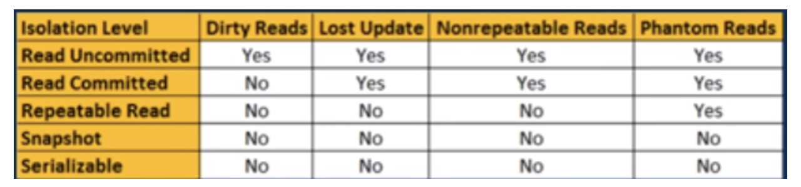

# Section 1 - Transactions

## Read Uncommitted
Any change in any transaction (whether committed or not) can be observed in other transactions in between.

## Read Commited
Only commited changes from other transactions are visible in our transaction.

## Repeatable Read
Even if data is changed, our transaction will consider the same data even when it is read again. (ONly in case of Postgresql, other shows different data)

## Serializable
All transactions are serialiaised. means one after the other like a queue.

**Note:** _If Dependency/Conflict found, It will rollback the remaining transaction which we try to apply. Eg- A & B are related. A applied. When B is being applied, it will throw error and rollback._

## Snapshot
Every transaction has it's own copy of data and works on it. Similar to Serializable but the changes of transaction A will not be visible in transaction B.

Official Postgresql transaction comparison: https://www.postgresql.org/docs/current/transaction-iso.html#MVCC-ISOLEVEL-TABLE

Note:
Some long failed transactions can create dead rows, which can alter the performance of the queries. So, when vacuum runs, it cleans those things.
