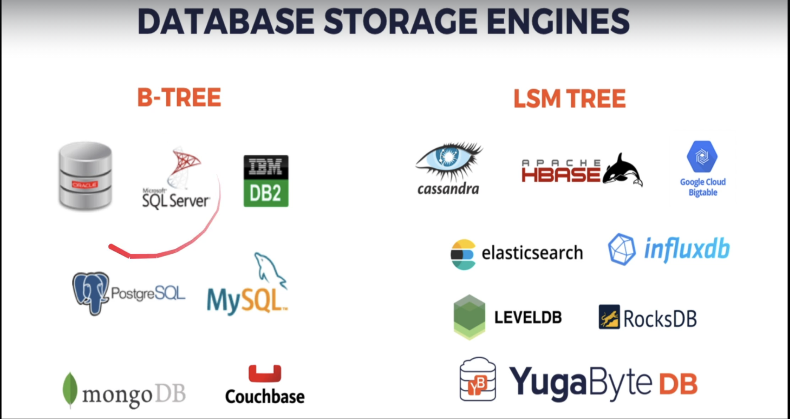

# Section 11 - Database Engines

## Database Engine
- DB Engine is like a library that takes care of the disk and crud operations.
- DBMS can use these engines and build features on top of them.
- Some DBMS like MySQL gives option to switch engines.
- Some DBMS don't like Postgres.

## Some Popular Engines

### MyISAM
- Indexed Sequential Access Method
- Open source, owned by Oracle
- B-Tree
- No transactions
- Inserts are fast, updates and deletes are problematic (fragments)
- DB crashes corrupts tables
- Supports only Table level locking
- It was default engine for MySQL earlier.

**Usecase:** If writing is the major concern with no Transactions

### Aria
- Similar to Aria but **Crash-safe**
- Not owned by Oracle

### InnoDB
- B+Tree - PK points to the row itself (directly)
- **All Indexes points to the primary key**
- DEFAULT for MySQL and MariaDB
- Supports ACID Transactions, Foreign Keys, Tablespaces, Spatial Operations
- also supports Row Level Locking (Very good)

**Usecase:** Kind of One Size fits almost all

### SQLite
- Very popular embedded db for local data
- B-Tree (LSM as extension)
- Postgres-like syntax
- Full ACID and Table Locking (mostly used by single client, so fine for most cases)
- Concurrent read and writes
- Web SQL in browsers uses it
- Included in many OS by default

### LevelDB
- Log Structured Merge Tree (LSM) - great for writes and SSD. Not good for deletions   (B-Tree and B+Tree are bad for SSD and lot of writes due to rebalancing modifying existing bits, SSD doesn't like it :) )
- No transactions
- Levels of Files
  - Memtable
  - Level 0 (young level)
  - Level 1-6
- As files grow large, levels are merged and written in disk. Basically, data is accumulated in files, when level reached, they are written in disk. There is a lag here but due to WAL, it becomes fail-safe. :)

**Usecase:** Historical Data, since data is not deleted

### RocksDB
- Facebook forked LevelDB and created RocksDB
- Transactional
- High Perf, Multi-threaded compaction
- A lot of new features
- MyRocks for MySQL, MariaDB and Percona   . LevelDB can't be used in MySQL etc
- MongoRocks for MongoDB

- Note: Here, couch db is good. :) It works on HTTP so helps us to avoid creating our own store in client side and backend. We can kind of use the database as a webserver
***Counch DB:** Seamless multi-master sync, that scales from Big Data to Mobile, with an Intuitive HTTP/JSON API and designed for Reliability.*
