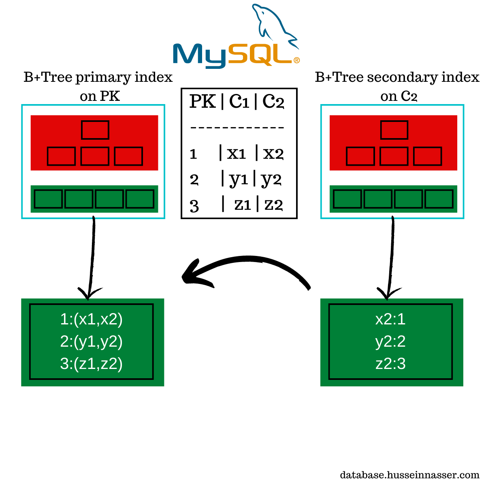
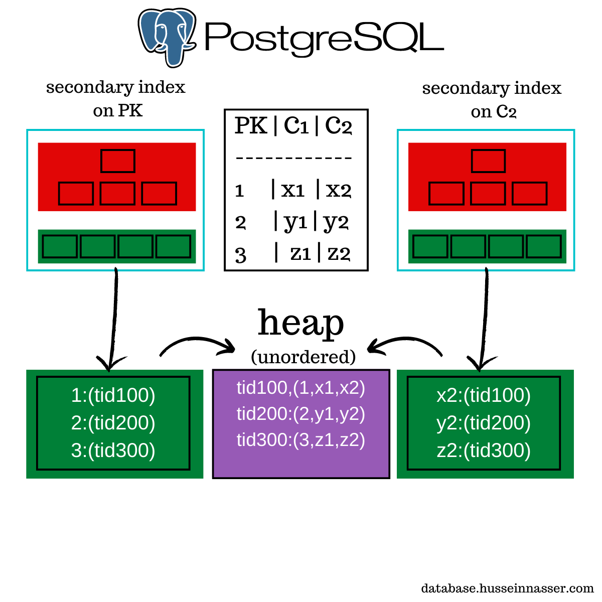

# Section 17 - Database Discussions

## WAL
- WAL stands for Write Ahead Log.
- It is a sequential log storing only the changes of each transaction.
- Every commit (update, insert, delete, transaction etc) are first written to WAL logs (persistent in permanent storage) and then after some time, flushed to the disk.
- Fast, Sequential, Less IO, provides fault tolerance with only WAL backup, easy rollback for transactions

<details>
<summary>Can't we directly write our changes to disk?</summary>
<markdown>Writing to disk is expensive since we have to identify the exact location where we want to do the changes, and writing on multiple places (since data is distributed) takes time. Also, huge amount of writes and very fast writes to a single block/sector in storage is bad for the health of storage unit (sdd / hdd respectively). </markdown>
</details>

## Why select count(*) is bad for perf?
- It is used to count the no of rows in the database based on given conditions.
- DB has to fetch count by visiting all of the pages.
- There is another way to find count in large system via only `explain` command and getting the response in json format. It gives the approx count sufficient for platforms like Insta likes.

<details>
<summary>Ok, enough. I will create Index for it. Would that work?</summary>
<markdown>Index is a good idea but in cases when table is vacuumed recently. You must be wondering why? The reason is, Postgres works on multi version concurrency and each update/ delete is added as a new version in the row itself in db. So, when we need the exact count, we have to go to the disk to do a heap scan to check which rows are inserted/deleted. Also, after adding millions of rows at once, Index takes time to update itself. So, it can't be a single source of truth.</markdown>
</details>

## Why Shopify switched from UUID? 
- ULID stands for Universally unique Lexicographically sortable IDentifier;


> ULID consists of two main components (01H0SJZ46B70QS1MBPRZP37MP3):
timestamp portion (48 bits) - 01H0SJZ46B
randomly generated portion (80 bits) - 70QS1MBPRZP37MP3

Shopify used MySQL, clustered Primary Key index is there. (Primary Key is the actual row Id in db)
They switched to ULID from UUID.
Sequential access in case of UUID will become random since pages are not sequential whereas ULID is sequential.

Size of ULID is large, and MySQL is clustered index. So, all secondary indexes will point to ULID which will increase size.


## How data is stored in Disk (HDD and SDD)?

Actual Db row are not stored directly in HDD. They are stored in form of pages in Sector (HDD) and Blocks (SDD).
Writes in SDD are problematic since SDD has some endurance and has some limit on no of writes.
Writes in HDD are not a problem but they are slow due to mechanical component.

<details open>
<summary>Why Facebook considered Rocks  DB?</summary>
<markdown>Rocks DB is based on LSM which is append only. So, there are very less rebalancing (compared to BTree) and increases life of SSD</markdown>
</details>


## What is a distributed transaction?
Usually, Microservices handles different responsibilities like Order, payment, cart service etc but they needs to work together to carry out a common high level task (place order). This "common high level task" needs to be carried out via Txn for atomicity (ACID).

*They can also be multiple processes in a single server. Doesn't always means different servers.*
 
### Solutions:
1. Google implemented atomic level accuracy in system clocks of distributed servers and manage distributed transaction based on timing.
2. We can create Undo / Report for all operations across microservices and have an agent who handles the state and send commands to all microservices in case of rollbacks.
3. Using Queueing Services like RabbitMQ / Kafka.
4. Go back to Monolithic Arch.  :)   Every developer loves Monolith, remember Amazon Prime Videos?

Remember, Small Startups never need microservices since monolith is perfectly fine for very less traffic, small team etc.

Why they are needed?
- Different programming lang needs to be used
- Different implementation required for different services
- If Service A needs ton of traffic on particular day, we don't have to degrade perf of other services since that heavy microservice can be scaled individually (in popular cricket match, all users starts tweeting just after the announcement of the results, so tweet service can be separated)


## Hash Tables and Consistent Hashing
TODO

## Indexing in Postgres vs MySQL

### MySQL
MySQL uses clustered Index. Primary Key is the primary index of the main btree.



#### Pros
1. If data is fetched by primary key, it is extremely fast.
2. Less Memory Usage (very minor difference since one more index btree doesn't has to be tracked)

#### Cons
1. Editing Primary Keys is a disaster since all records in btree needs to be updated.
2. Random unordered Ids are extremely slow for range queries

### Postgresql
All indexes in Postgres are secondary indexes. All indexes points to the rowId (even primary key) and that row id points to the actual data means 2 hops everytime in case retrival by key.



#### Pros
1. Unordered keys are not an issue since it is managed by postgres.
2. Editing primary key is not a problem since main btree is completely isolated and only primary key to rowId index needs to be updated.

#### Cons
1. Retrival by primary key are comparitively slow due to 2 hops.
2. Edits create new row_id (tid - transaction id) which needs to be updated in all indexes.

## Why Uber switched from Postgres to MySQL?
[official uber blog](https://uber.com/en-IN/blog/postgres-to-mysql-migration)
### 1. Write Amplification
They had multiple indexes. Adding/Updating was creating new row (since postgres has immutable rows) and all indexes needed to be updated with all these new Ids and also the WAL logs. Since, Indexes are just a btree, it required new resources for applying this rebalancing.

### 2. Replication
Large WAL because it contains all events in very granular level and this had to be transmitted to all replicas which was consuming huge bandwidth and slow. Also, some transaction blocks the WAL log transmission which caused ~2 seconds of delay in WAL across replicas. (mismatch in data, sounds bad :') )

### 3. Bug in Postgres older version caused corrupt data (Patched now)
There was bug which caused incorrect applied WAL which caused mismatch in data but fortunately, they had a master node with correct data which helped them to recover their system.
Since it was in WAL, it mitigated to all replicas/nodes which caused this issue.

### 4. Updating Postgres is tough (Patched now)
It is not possible to do replication in different postgres versions. So, updating pg version meant a lot of downtime since it needed to be stopped, replica updated, WAL applied, other replica updated, WAL applied, and so on. Took them hours. 


### Let's Understand why InnoDB (MySQL)
#### 1. Replication has multiple options. Instead of granular changes, complete query can be transmitted via InnoDB (Postgres also support that via addon but they didn't mention :)  )

#### 2. In file, mysql does in row changes for handling mvcc which helps them avoid updating all indexes. (has a field for keeping old state, then applies changes, in case of rollbacks and confirm check from prev values, no need to create new row)

#### 3. They can run more connections since they have threads instead of processes like Postgres which is resource intensive.

#### 4. Update is easier with almost no downtime. 


## Is NULL good for DB?
Short Answer, YES.
- Database tracks the nulls/data filled using bits (each column, 1- filled, 0 empty).
- Make sure db supports null in indexes. (Oracle db doesn't support it, it doesn't store in indexes)
- If db is not queried based on NULL, it is best case scenario to create index without NULL and it will be optimised to run queries.
- Null means less data, means more rows in a page, means less IO..   :)

> *DB are very efficient in storing NULLs*


```
T = Null    - not valid
T IS NULL   - valid
T IS NOT NULL - valid
T IN [NULL] - not valid
```

## Write Amplication (Covered in Uber Migration from PG to MySQL)
### 1. Application Write Amplification
- POOR architecture, which can cause mulitple writes to be done on db.

### 2. Db write amplification
- Updating/Creating a row makes all indexes linked to it needs to be updated. (Now postgres handled this, only one index is updated :0 )
- What about WAL? that needs to be transmitted for all. right?
- FAQ: Toast table also increments this issue. (large strings are stored separately)

### 3. SSD (Disk) Write amplification
- SSD works on basis of trapping electron in metal blocks which represents memory.
- Update in SSD means pasting data at new location and reference new location.
- Garbage Collection runs periodically since old locations needs to be cleared.
- LSM is append only and SSD likes it since it doesn't have to do random access/ garbage collection etc.


## Optimistic vs Pessimistic Concurrency Control
#### TODO
