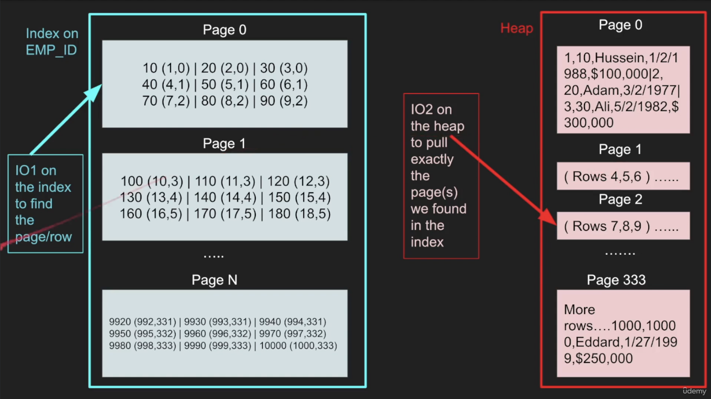

# Section 3 - Understanding Database Internals

## How Tables and Indexes are stored on disk?

### Table
- Table refers to structured data with rows and columns. // remaining part is just common knowledge

### Row_id
some db (mysql- innoDB) use the primary key as row_id and some db (postgresql) uses it's own id as row_id.
contains some extra data for easy page no identification for quick access

### Page
- Each page has a size (8 KB in postgres and 16KB in MySQL)
- Table Records are stored in multiple pages

### IO
- IO operation is a read request to the disk
- IO reads a complete page which gives extra rows for free.
- Minimize IOs, Expensive. needs deserialization, searching etc.
- OS caches this result as well. 

### Heap
- Data Structure where table is stored with all pages
- Traversing Heap is expensive
- Thats why indexing is required to reduce cost instead of reading complete heap

### Index
- Pointers refering to the row_id where our data is.. 
- Also stored as pages and cost IO. So, index must be small.
- Smaller Index, more it can fit in memory the faster the search.
- B-trees are usually used.

#### Search when Index is Added
First search in Index, (It has less pages, means faster) then after getting the page index, get that specific page directly avoiding one by one check (large reads from disk avoided).

#### Notes
1. When heap table is organised around a single index, then it is called clustered index like in case of mysql which has primary key and other indexes point to the primary key.
2. Postgres only have secondary indexes and all indexes point to the row_id directly which lives in the heap.
3. primary keys is usually a clustered index uless otherwise specified.

## Row based vs Column based Database

### Row Based Database
1. Complete Row data is stored together (see top image). So, good in case of accessing all row data / most of the raw data.
2. If only couple of columns are searched instead of complete db, then it is not efficient since IO is expensive.

### Column Based Database
1. Data is stored separately for different columns. basically, some heap contains only name field, some other heap contains only age and so on.
2. It is good for accessing couple of columns since IO is reduced but bad in case of all data/most data since IO will significantly increased at that time.

| Row Based DB | Column Based DB |
| :----------- | :-------------- |
| Optimal for read/writes | Writes are slower |
| [Online Tranaction Processing](https://www.oracle.com/in/database/what-is-oltp/) | [Online Analytical Processing](https://aws.amazon.com/what-is/olap/) |
| Compression is not good | Compression is good |
| Aggregation is not efficient | Aggregation is Efficient |
| Efficient Queries w/multi-columns | Inefficient Queries w/multi-columns |

