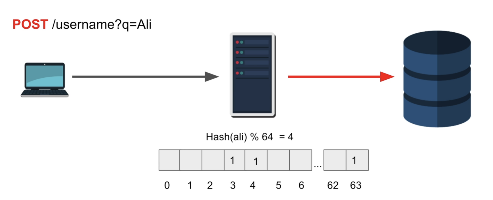

# Section 4 - Database Indexing

## Inserting fake data in million rows

#### Create table
```sql
create table temp(t int);
insert into temp(t) select random()*100 from generate_series(0, 1000000);
select t from temp limit 10;
select count(*) from temp;
```

**Note:** _In case of multiple column, add comma after random()*100 and add remaining col values._


## Indexing
* Indexes are stored in form of B Trees just like table data in pages on heap.
* Every Primary key has index by default.


### Creation of Index
```sql
create index employees_name on employees(name);
```

### Problem with Index Creation
Creation of Indexes blocks all write/update operations since indexing refers to creation of b+tree index and concurrent insertions are almost impossible to manage due to pre defined tree structure. 


<details>
  <summary>Solution</summary>
  <markdown>
  We have another way of index creation which slows down the creation but works in production with no downtime. It works in a way that it logs the last commit hash of wal log and starts creating the index. After creation, goes through the WAL logs and check which new commits are not added in index. Then adds those commits. It keeps on repeating this process until all records are indexed in the DB. Our index creation is stuck until it is completely syned.
  </markdown>
</details>


Above command goes through all records and create a bitmap for it on name columns..

```sql
-- Example
explain analyze select id, name from employees  where name like '%Zs%';
```

Before Index: 1.317 sec in million records 
After Index: Same Results

**Reason: Index works on only exact match like 'Zs' instead of '%Zs%' but when index works, it is reduced frmo seconds to 40-50 ms only**

Some good examples for only explain (without analyze): 
1. Sorting - will show parallel seq scan and Sort part costing.
2. Only Primary key fetching - uses inline query to fetch from index only, optimized.


##### Queries Speed : Only Index search < Index Search and then table memory lookup via row_id < complete table lookup


## Bitmap Index Scan vs Index Scan vs Table Scan

### Table Scan
A table scan is the reading of every row in a table and is caused by queries that don't properly use indexes

### Index Scan
In case of gte or lt type of conditions but less records are going to be returned, postgres will do random access to the table for getting all records one by one.

### Bitmap Index Scan
In case of gte or lt type of queries on indexed column which returns a lot of records (postgres is smart), it aggregates results after checking all values from table index. After that, it goes to the table and fetches the pages which contains these records' rows_id and with a recheck (no such overhead), includes them in the result. (NO REPEATED VISITS TO PAGES)

Bitmap And Index Scan: If and / or query is used in indexes, it creates bitmap for both indices and does and operator to find the required rows for later fetching.

## Key vs Non Key Column Database Indexing

### Non Key Column Indexes  (Maybe called as Composite Index)
Column which are added in the index but can be returned if index based query is done.
In simple words, considering it to be a hashmap, key is the actual indexed column and the value will contain two fields (row_id and non key column).

```sql
create index g_idx on students(g) include (id);
```
 In above example, index is created on grade but id is added as non key, so that we can do our query and can fetch id of that record as well without **hopping on to the disk**

 **Note:** It increases the size of the index, so make sure it is done when it is required the most.

### Key Column Indexes
can be used for queries. Refers to the grade (g) in above example.


## Index and Index Only Scan
**Index Scan:** Database has to fetch the row_id from index and then fetch that/those records from the table.
**Index Only Scan:** Database was able to serve the query from the index only.


## Data Optimizers Trivials
1. Database keep statistics of all tables like how many rows have avg x value, and other parameters.
2. if we are indexing but it is gonna result a lot of results, It will return from complete table scan.
3. If we are doing and in two completely different indexes, It will index on 1 index and then go to table for fetching records. Reason : Bitmap Scan is still a bit expensive. since we also have to do BitMapAnd. And later fetch from disk.
4. Database is smart enough to change this based on statistics.
5. It is good to run vacuum so that db can update stats which can help with these things. It is automatically done by db as well.
6. If we insert millions of rows and do a query, stats are not updated till then. So, instead of index, It can do full table scan even during favourable conditions. :) It can be bypassed with Database Hinting. 

## Creating Index in Production
**Problem:** If we are creating index on a field, then it will lock all write operations since index is dependent on it. Read won't be affected.

**Solution:**
```sql
create index concurrently g on grades(x);
```
 Allows reads and writes when index is being created. 
 It fires up multiple transactions and waits for them. 
 Takes extra resources (CPU and memory) and also the time. Some chance of failing if duplicate or critical changes are done sideways.

 > PostgreSQL must perform two scans of the table, and in addition it must wait for all existing transactions that could potentially modify or use the index to terminate. [ref](https://www.postgresql.org/docs/current/sql-createindex.html#SQL-CREATEINDEX-CONCURRENTLY)


 ### Bloom Filter



 Create an array of bits with arbitary static number (let's say, 64), if we search for a username, it will do a hash of that username and mod by 64. It will mark bit of result index as 1. Next time when we have to check for username, we will first check in this array instead of repeated IO.

 Note: 
 1. If it is present in array, it could also be due to other username. So, if found we must have to check db. If not found, no need.
 2. In reality this can be very complex like 3 different locations of arrays, multiple hash functions but core concept remains same.


## Working with Billion-Row Table
1. Bruteforce search in db by parallel scan without using anything fancy like index.
2. Bruteforcing is too much, we can use indexing and save IO.
3. Now, index can be huge, Right?!  We can do horizontal partitioning (divide data among multiple tables). (Partitioning + Indexing - Sounds good :)).
4.  We may also have to do some sharding. So, order becomes Shard -> Partition -> Index

Note: Sharding Refers to dividing data among mutiple locations, Paritition refers to further dividing table in same location (same db, multiple locations of that table)
