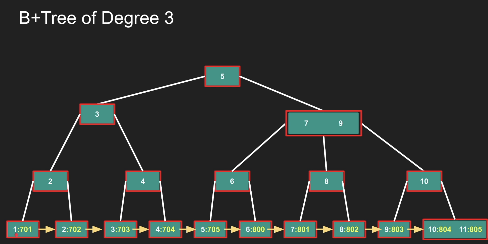

# Section 5 - Btree

## B-Tree

- Here, each node contains the data as well.
- each node is considered as a page.

## B+Tree

- In B+Tree, only leaf nodes contains the actual data and can have duplicate intermediatory nodes.
- It is a little expensive but all of them are linked to each other promoting fast retrieval in case of continuous data.

