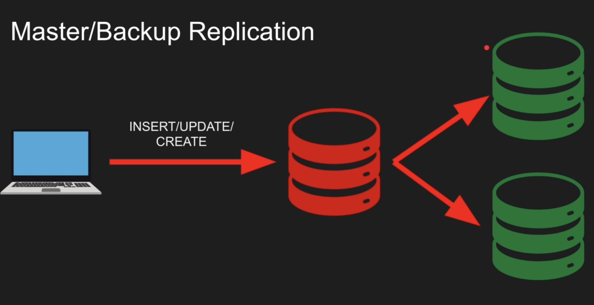

# Section 9 - Database Replication

## Master/Backup Replication

- Only one master node accepts writes / DDLs
- One or more backup/standby nodes receives these writes from Master via TCP
- Simple Implementation, no possibility of conflicts

## Multi-Master Replication
- Multiple Master/Leader node that accepts writes/DDLs
- One or more backup/follower nodes that receives those writes from the masters
- Need to resolve 

## Synchronous vs Asynchronous Replication

### Synchronous Replication
- Master will be blocked untile writes are written to some of the backup nodes (no of nodes can be configured)
- Reason: In case of failure of Master, we will have the latest changes in some of our backup nodes

### Asynchronous Replication
- Master is not blocked, do write query and instantly marks as successful
- Backup/Standby nodes will get latest data by Eventual Consistency
- Reason: In case of large application with less important data, we don't want to slow down our queries


## Demo (One master, one standby node)
```sh
docker run --name pmaster -p 5432:5432 -v /Users/chetan/postgres/rep/pmaster_data:/var/lib/postgresql/data -e POSTGRES_PASSWORD=postgres -d postgres

docker run --name pstandby -p 5433:5432 -v /Users/chetan/postgres/rep/pstandby_data:/var/lib/postgresql/data -e POSTGRES_PASSWORD=postgres -d postgres

docker stop pmaster pstandby

mv pstandby_data pstandby_data_bk
cp -R pmaster_data pstandby_data

docker start pmaster pstandby
```

Open pmaster_data and edit pg_hba.conf file
```sh
// In replication connections section, add -
host replication postgres all md5
```

Open pstandby_data and edit postgresql.conf
```sh
// primary_conninfo
primary_conninfo = 'application_name=standby1 host=chetanMac port=5432 user=postgres password=postgres'
```
**Explanation:**
- **application_name:** unique application name given to each replica
- **host**: can be received from hostname command
- **port**: port to be used for connecting with master
- **user**: master username
- **password**: master password

Create standby.signal, makes instance a readonly instance and standby instance
```sh
touch standby.signal
```

Now, Open pmaster_data and edit postgresql.conf file
```sh
synchronous_standby_name = 'first 1 (standby1)'
```
Here, we can give more names in paranthesis and change first 2 to someething else for more finegrained control in case of failure.

```sh
docker start pmaster pstandby
docker logs  pmaster
// will see something like standby1 is now sync standby
docker logs  pstandby
// will see something like streaming WAL from ...
```

Testing
```sh
docker exec -it pmaster psql -U postgres
select * from pg_stat_replication;
// gives replication info of master
```


Points to Remember:
- Create proper user instead of using postgres user for replication, master
- Writing in standby will throw error since it is readonly


## Pros
- Horizontal Scaling
- Region based queries = DB per region

## Cons
- Eventual Consistency
- Slow Writes (sync)
- Extra Complexity Overhead
